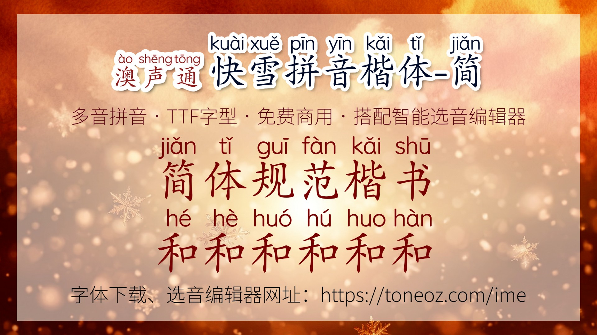
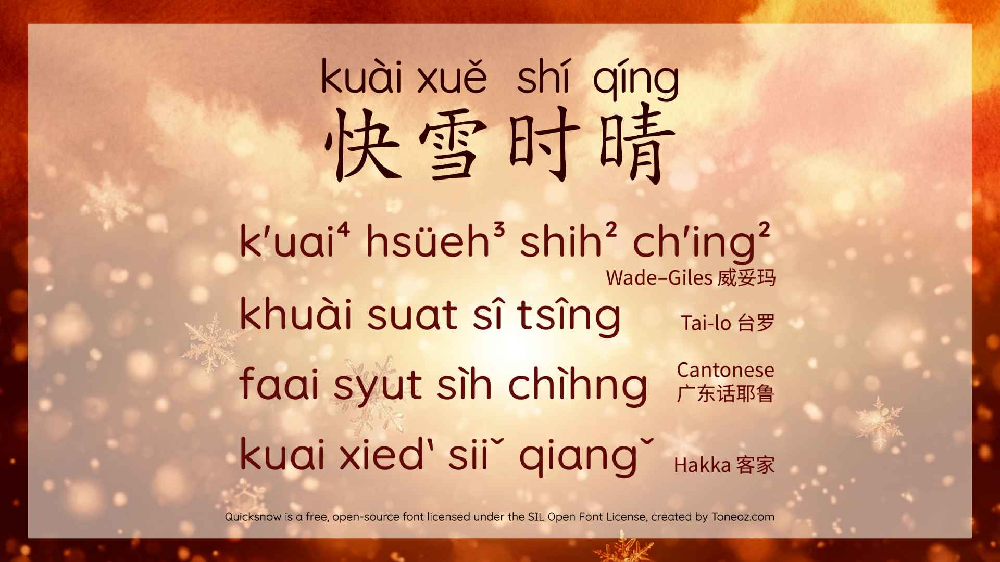
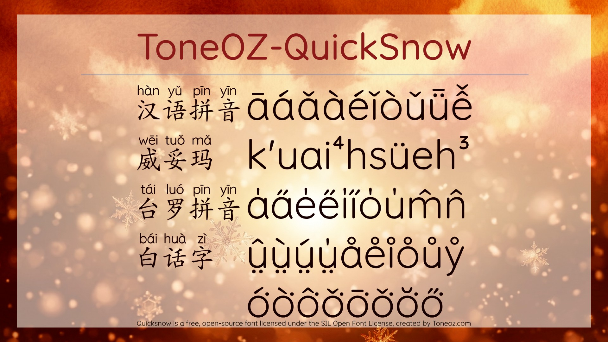

  
# 澳声通 快雪拼音楷体-简体版 ToneOZ QuickSnow Pinyin Kai Simplified

---

## 简介

在汉字上方标注拼音的字体，融合汉语拼音与标准楷体，并采用圆体大字澳声通「[Quicksnow 快雪时晴](https://github.com/jeffreyxuan/toneoz-font-quicksnow)」作为英数字母与拼音字体。支持一字多音和破音字，致力于提供接近高品质教材级别的阅读体验。提供免费、免安装的 **拼音注音编辑器**，支持多音字自动校正：

[https://toneoz.com/ime](https://toneoz.com/ime)

编辑器也可配合教学方案，切换普通话与国语的两岸差异读音，方便教师根据不同教学场景灵活使用。

---

## 您的支持

请帮忙写推荐文章。真的，这很重要。

现在市面上很多拼音字体仍然只有单一读音，但因为历史悠久、网上资料又多，用户搜索“拼音字体”时，往往先看到的就是这些字体。时间一长，错误或不完整的拼音反而会变成常态。

如果澳声通拼音字体对您有帮助，恳请您在公开网站写一篇介绍或推荐文章。最好能用您自己的话，分享实际的教学经验、使用场景或观察。这样的文章内容会更充实，也更容易被搜索系统视为有价值的分享，让更多人看到澳声通，并推动整个网络环境中的拼音教学质量逐步提升。

---

## 字体下载

  [https://toneoz.com/blog/quicksnow](https://toneoz.com/blog/quicksnow)

---

## 汉字配拼音字体在线展示：  
  请在字体菜单中选择「快雪」系列：  
  [https://toneoz.com/ime](https://toneoz.com/ime)

---

## 特色

- 免费、开源、可商用。采用 **OFL（Open Font License）** 授权发布，可放心使用，无需额外付费。
- 字形风格接近课本用字，符合教育规范笔形
- 汉字上方的拼音部分采用动态字宽排版，更符合英文阅读习惯
- 小字号下仍保持较高辨识度
- 笔画清晰，易于区分
- 拼音字体与正文在功能上做出明确区隔
- 支持多音字一字多音
- 兼容 [IVS 字嗨注音规范](https://github.com/ButTaiwan/bpmfvs)，切换字体时读音不会错位

---

## 汉字上方的拼音：澳声通「[Quicksnow 快雪时晴](https://github.com/jeffreyxuan/toneoz-font-quicksnow)」英数字拼音字体

通过拼音学习中文，罗马字拼音非常重要。因为正文通常使用宋体或黑体，出版时常会另外采用更易辨认的圆体来标注拼音，让读者一眼就能看出那是发音信息。

这类字体通常会尽量做到清晰、简洁、易认，同时也要支持各类语言教学所需的拼音符号。

为了辅助教材制作，澳声通 ToneOZ 谨呈「[Quicksnow 快雪时晴](https://github.com/jeffreyxuan/toneoz-font-quicksnow)」系列拼音字体。

 

澳声通 [快雪时晴 QuickSnow](https://github.com/jeffreyxuan/toneoz-font-quicksnow) 英数字体，是基于 Google Fonts 的开源字体 [Quicksand](https://fonts.google.com/specimen/Quicksand?preview.script=Latn) 改造而来。

Quicksand 这套字体最早由菲律宾裔、旅居迪拜的设计师 Andrew Paglinawan 于 2008 年发起；2016 年由爱尔兰／埃及裔设计师 Thomas Jockin 进一步提升字体质量；2019 年则由旅居纽约的南斯拉夫裔设计师 Mirko Velimirovic 制作了可变字重版本。

在这样一个跨国团队的持续接力下，Quicksand 原本就对西欧、南欧拉丁字母以及越南语有较好的支持。

---

## 母字体

- 简体免费商用授权来自 : 文鼎PL简中楷  
  [《ARPHIC PUBLIC LICENSE 1999》](http://ftp.gnu.org/non-gnu/chinese-fonts-truetype/LICENSE)
- 正文汉字中的英数字符部分基于「[FONTWORKS Klee One](https://github.com/fontworks-fonts/Klee)」以及「[LXGW 霞鹜文楷](https://github.com/lxgw/LxgwWenKai)」，采用 SIL Open Font License 1.1 免费商用授权。

---

## 鼓励或建议

作者 : Jeffrey Xuan
- Email: [jeffreyx@gmail.com](mailto:jeffreyx@gmail.com)
- WeChat: [chihlinhsuan](https://weixin.qq.com/)
- LINE: [jeffreyxiphone2018](https://line.me/)
  

